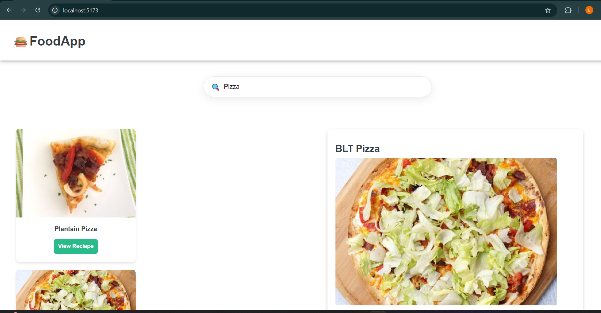
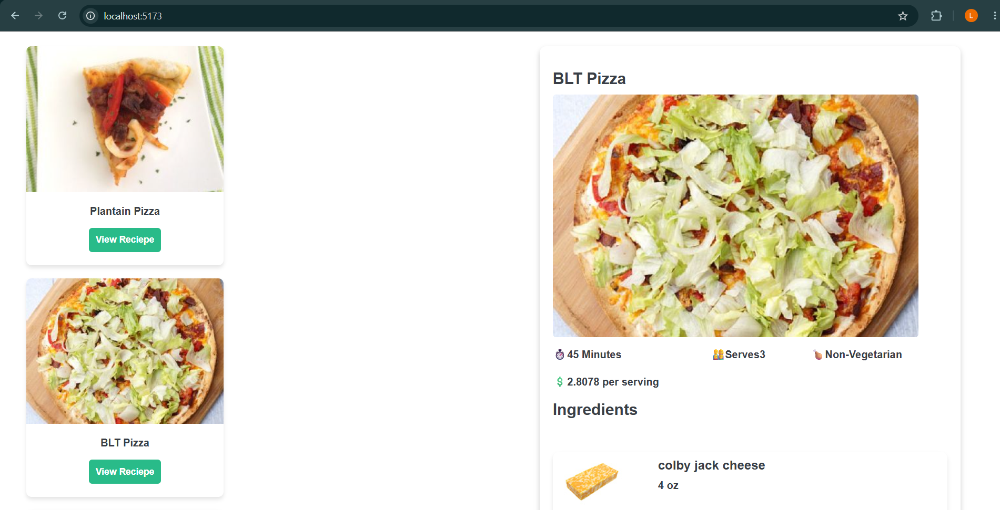
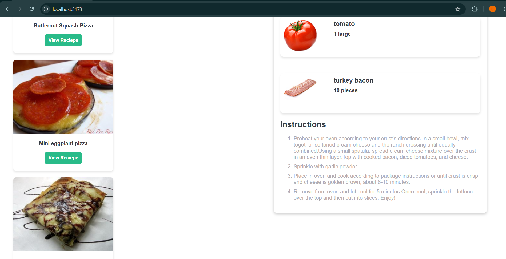
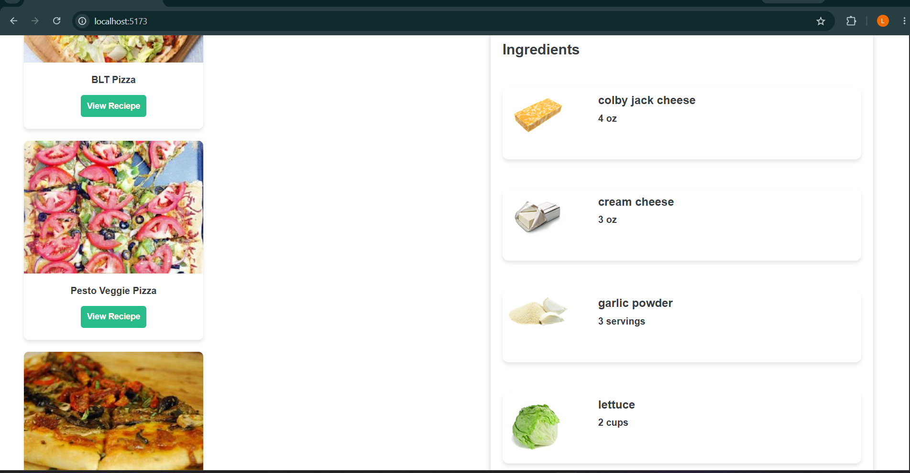

# 🍽️ Recipe Finder App


A modern and responsive recipe discovery application built using React.js and the Spoonacular API. Users can search for food items and instantly get detailed recipes, ingredients, cooking instructions, and nutritional information.

## 🚀 SYSTEM OVERVIEW

Foodify is a frontend-based recipe search application designed using React component architecture for scalability and maintainability. The application consumes the Spoonacular REST API to fetch recipe data dynamically and presents it through an interactive and responsive user interface.

## 🚀 Features

### 🔍 Recipe Search

* Search recipes by food name
* Instant API-based recipe retrieval
* Dynamic search results
* Responsive search interface

### 🍽️ Recipe Details

* View complete recipe information
* Display cooking instructions
* Show preparation and cooking time
* View serving size information

### 🥗 Ingredients Information

* Complete ingredient list
* Ingredient quantities and measurements
* Detailed recipe composition
* Easy-to-read ingredient display

### 🌐 API Integration

* Real-time data fetching using Spoonacular API
* Dynamic content rendering
* Efficient API request handling
* Error handling for invalid searches

### 📱 Responsive User Interface

* Mobile-friendly design
* Interactive React components
* Clean and modern UI
* Fast client-side rendering


## 🧠 Architecture Overview

* Component-based React architecture
* REST API integration using fetch/axios
* State management using React Hooks
* Dynamic rendering of recipe data
* Reusable UI components
* Responsive frontend design


## 🛠️ Tech Stack

### **Frontend**

* React.js
* HTML5
* CSS3
* JavaScript (ES6+)

### **API**

* Spoonacular API

### **React Features**

* Functional Components
* React Hooks
* State Management
* Conditional Rendering

### **Tools**

* npm
* Axios / Fetch API
* VS Code


## ⚙️ Workflow

1. User enters a food item in the search box
2. Search request is sent to Spoonacular API
3. API returns recipe information
4. React updates the application state
5. Recipe cards are rendered dynamically
6. User selects a recipe
7. Detailed ingredients and instructions are displayed


## 🔗 API Endpoints

### Search Recipes

```http
GET /recipes/complexSearch
```

### Get Recipe Information

```http
GET /recipes/{id}/information
```

### Get Recipe Ingredients

```http
GET /recipes/{id}/ingredientWidget.json
```

---

## Clone Repository

```bash
git clone https://github.com/Aryan-Kundalwal/Foodify
```

## Navigate to Project Directory

```bash
cd FOOD-RECIPE-APP
```

## Install Dependencies

```bash
npm install
```

## Start Development Server

```bash
npm start
```

---

## 📁 Project Structure

```text
FOOD-RECIPE-APP/
│
├── public/
├── src/
│   ├── components/
│   ├── redux/
│   ├── App.jsx
│   ├── main.js
│   
│
├── screenshots/
├── package-lock.json
├── package.json
├── eslint.config.json
├── vite.config.js
├── README.md
│
└── .gitignore
```

---

## 📸 Application Screenshots

### 🔍 Search Recipe

<p align="center">
  
  
</p>

### 🍽️ Recipe Details

<p align="center">
  
  
</p>

### 🥗 Ingredients

<p align="center">
  
</p>


## 📌 KEY ENGINEERING HIGHLIGHTS

* Dynamic API integration using Spoonacular
* Component-based React architecture
* Efficient state management using Hooks
* Responsive user interface design
* Real-time search functionality
* Reusable and modular components
* Clean frontend code structure


## 🚀 FUTURE ENHANCEMENTS

* Favorite recipes functionality
* Recipe bookmarking system
* Advanced filtering options
* Nutrition analysis dashboard
* Meal planning feature
* Dark mode support
* Search history functionality
* User authentication system

## 👨‍💻 Author

* GitHub: https://github.com/Aryan-Kundalwal
* LinkedIn: https://www.linkedin.com/in/aryankundalwal

